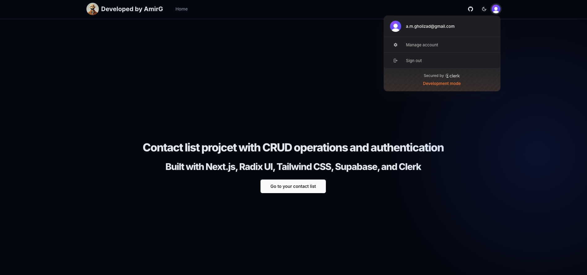
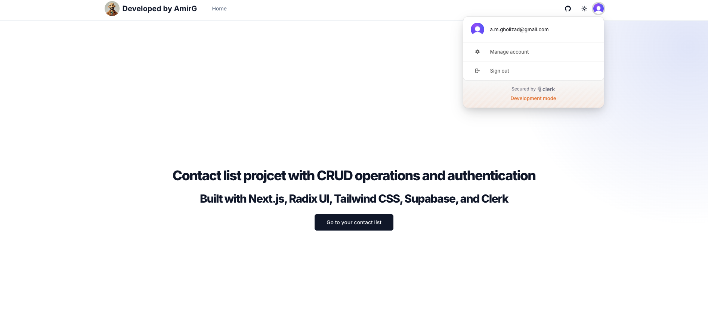
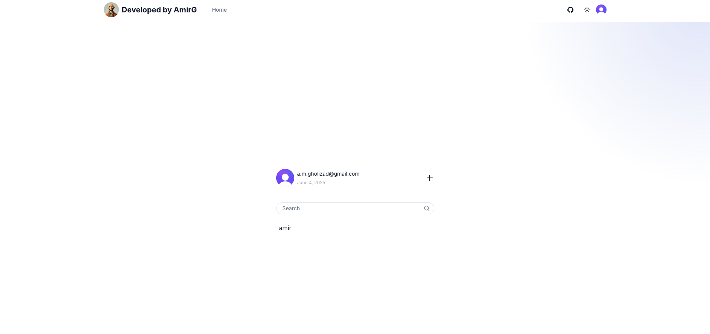
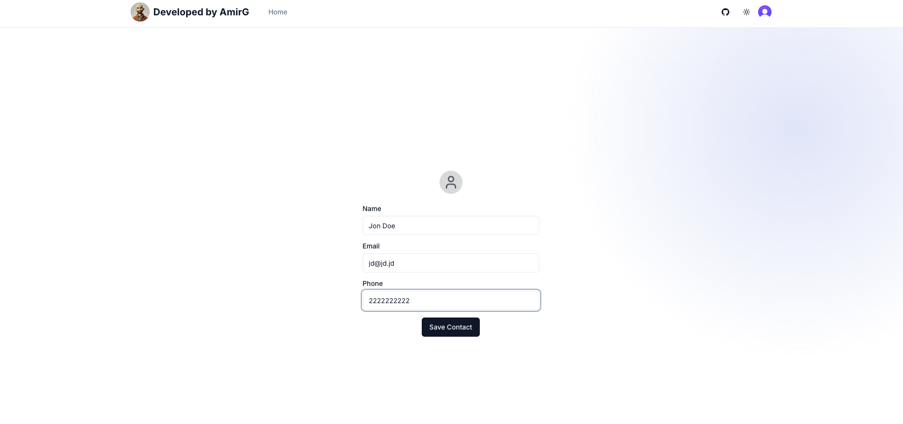
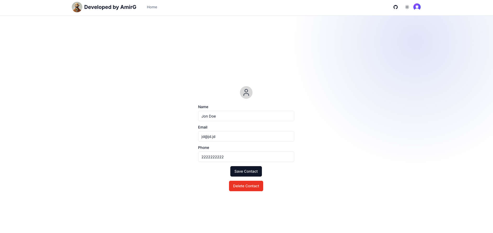

# 📇 Contact Manager App

A simple but complete contact management web application built using modern web technologies. This project was completed as part of a technical assignment and simulates a realistic full-stack task.

Live Demo 👉 [Add your Vercel link here]

---

## 🛠 Tech Stack

- **Framework**: [Next.js](https://nextjs.org/) (App Router)
- **Language**: TypeScript
- **UI & Styling**:
  - [TailwindCSS](https://tailwindcss.com/)
  - [Radix UI](https://www.radix-ui.com/) (for accessible UI primitives)
- **Backend & Auth**:
  - [Supabase](https://supabase.com/) (database, auth, storage)
  - [Clerk](https://clerk.dev/) (user authentication & session management)
- **Forms & Validation**:
  - [React Hook Form](https://react-hook-form.com/)
  - [Zod](https://zod.dev/) (schema-based validation)
- **State & Data Fetching**:
  - [React Query](https://tanstack.com/query/v4) (for API data fetching and caching)

---

## ⚙️ Setup

To run this project locally:

1. **Clone the repo**:

   ```bash
   git clone https://github.com/your-username/contact-manager.git
   cd contact-manager
   ```

2. **Install dependencies**:

   ```bash
   npm install
   ```

3. **Set up environment variables**:
   Create a `.env.local` file and add your Supabase and Clerk environment variables:

   ```env
   SUPABASE_URL=your_supabase_url
   SUPABASE_ANON_KEY=your_supabase_anon_key

   NEXT_PUBLIC_CLERK_PUBLISHABLE_KEY=your_clerk_key
   CLERK_SECRET_KEY=your_clerk_secret
   ```

4. **Run the app**:
   ```bash
   npm run dev
   ```

---

## ✨ Features

- 🔐 **Authentication** with Clerk (Sign in / Sign up)
- 📃 **View contacts** with name, email, and phone number
- ➕ **Add contacts** via a form with field validation
- ✏️ **Edit contacts** using inline modal form (required feature)
- 🗑 **Delete contacts** with confirmation
- ⚡ **Real-time UI updates** using React Query & Supabase
- 🎯 **Form validation** with Zod + React Hook Form
- 📱 Fully responsive layout using TailwindCSS

---

## 🧠 Design Decisions

- **App Router**: Took advantage of the Next.js App Router for better route separation and async rendering.
- **Clerk + Supabase**: Used Clerk for robust user auth and Supabase for the database and RLS.
- **Radix UI**: Chose Radix for accessibility-first primitives and composability instead of ShadCN.
- **Zod + RHF**: Combined Zod schemas with React Hook Form for a seamless validation experience.
- **React Query**: Implemented for consistent and performant data fetching with caching, loading states, and optimistic updates.

---

## 🐛 Known Limitations

- No E2E tests implemented due to time constraints.
- UI polish (animations, transitions) is minimal.
- No CI/CD integration yet (e.g., GitHub Actions).
- Basic error handling — needs improvement in edge cases.

---

## 🚀 Future Improvements

- ✅ Add optimistic updates for better perceived performance
- 🧪 Add E2E testing with Playwright
- 🛡 Add Supabase Row-Level Security policies for full data safety
- 🔄 Add pagination or infinite scroll for large contact lists
- ⚙️ Integrate GitHub Actions to automate build, type check, lint, and tests

---

## 📸 Screenshots

_Add screenshots of the contact list, form modal, and mobile layout if desired._

---

## 📬 Contact

Made with ❤️ by [AmirG](https://github.com/your-username)

## Demo






